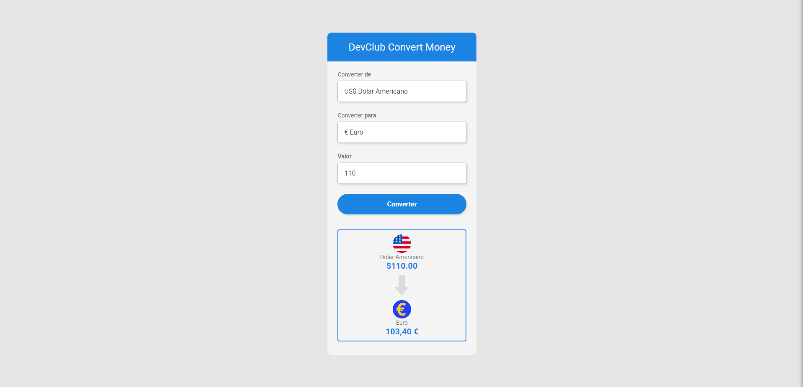

# Convert Money 💵💶💷

O Convert Money é uma aplicação onde você pode fazer conversões de moedas.

O projeto foi desenvolvido para cumprir o desafio final do módulo de JavaScript da formação Full Stack PRO do DevClub.

## O desafio

Criar um sistema que converte valores em Real para outras moedas como: Dólar, Euro e Bitcoin. E exibe na tela o valor que você deseja converter e o valor convertido juntamente com sua respectiva moeda.

Como bônus deixei o sistema mais flexível e fiz com que ele não apenas converta de real para outras moedas. Mas também de outras moedas para o real...

[ 🔗 Clique aqui para acessar](https://joaoliveirapb.github.io/convert-money/)

## 🛠️ Tecnologias

- JavaScript
- HTML
- CSS
## 💙 Contato

joaoliveira.batista1@gmail.com
